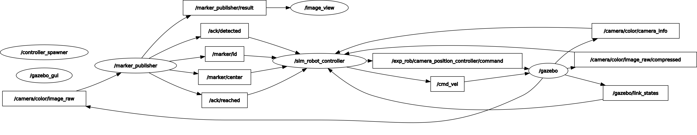
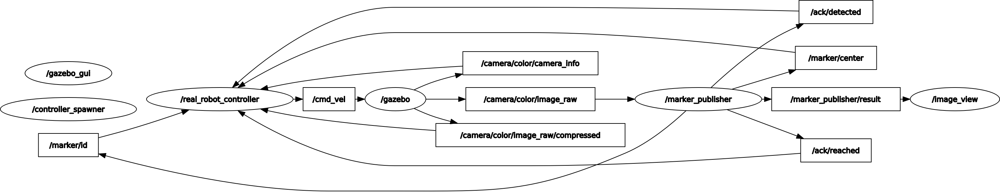
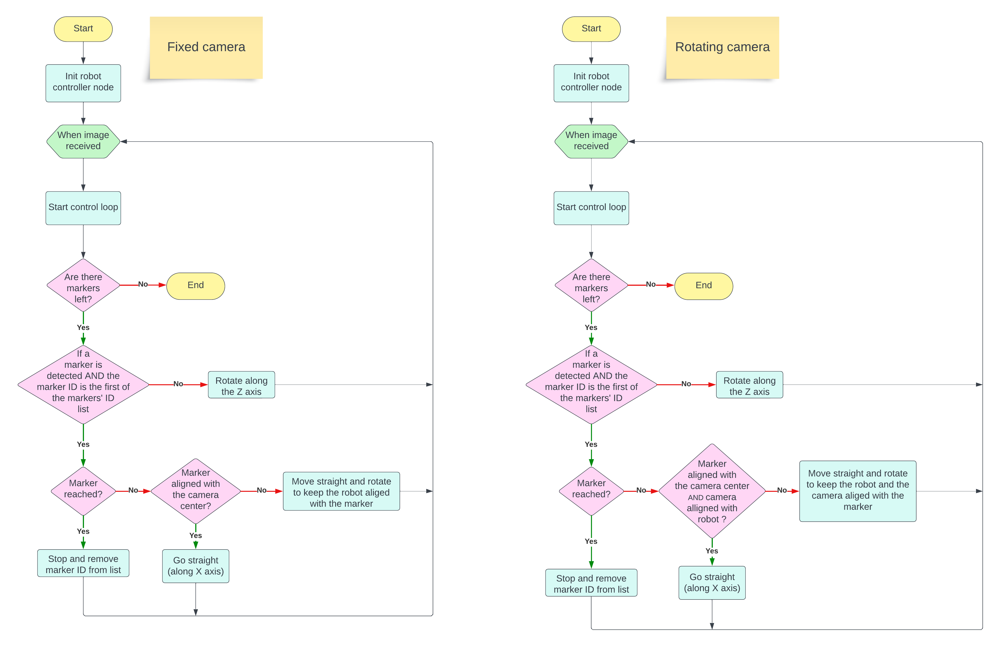
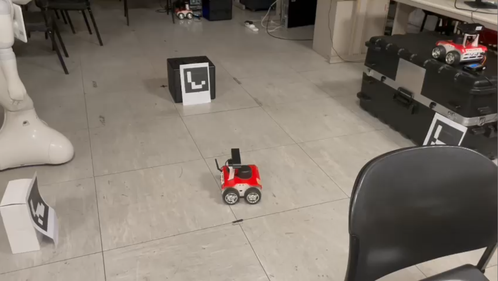

# Assignment 1

## Group members

| Name Surname          | ID       |
| --------------------- | -------- |
| [Gabriele Nicchiarelli](https://github.com/gabri00) | S4822677 |
| [Ivan Terrile](https://github.com/Ivanterry00)         | S4851947 |
| [Miriam Anna Ruggero](https://github.com/Miryru)   | S4881702 |
| [Davide Pisano](https://github.com/DavidePisano)        | S4363394 |

## Preliminary operations

Install dependencies:

```bash
cd ~/<your_workspace>
rosdep install --from-paths src --ignore-src -r -y
```

Build the workspace:

```bash
cd ~/<your_workspace>
catkin_make
```

## Run Gazebo simulations

Run the simulation with rotating camera:

```bash
roslaunch rosbot_gazebo assignment_gazebo.launch
```

Run the simulation with fixed camera:

```bash
roslaunch rosbot_gazebo assignment_rosbot.launch
```

## Run on the Rosbot

#### Step 1: Connect to the local network

| Network name | Network password |
| ------------ | ---------------- |
| TP_LINK      | 03694008         |

#### Step 2: Add the ROS master URI and user's IP address

Add the following lines at the bottom of the `~/.bashrc` file:

```bash
export ROS_MASTER_URI=https://192.168.1.10x:11311
export ROS_IP=<YOUR_IP_ADDRESS>
```

#### Step 3: Connect to the robot via SSH

In the local terminal:

```bash
ssh husarion@192.168.1.10x
# x is the identifier number of the robot (written on the bot)
```

**Password**: husarion

#### Step 4: Start the drivers

In the Rosbot terminal:

```bash
roslaunch tutorial_pkg all.launch
```

#### Step 5: Start the simulation

From the local terminal:

```bash
roslaunch rosbot_gazebo real_rosbot.launch
```

## Description of the packages

This project consists in making the Husarion Rosbot detect the ArUco markers in order.

The [marker publisher node](/src/aruco_ros/src/marker_publish.cpp) is responsible of detecting the markers and communicating ID and center of the detected marker to the *controller node*. This node also communicates to the *controller node* when the desired marker has been reached.

The controller node is provided in two formats:
- The [real robot controller](/src/rosbot_navigation/scripts/real_robot_controller.py) which controls the real rosbot. In this case the camera is fixed and the whole robot has to rotate to detect the markers.
- The [sim robot controller](/src/rosbot_navigation/scripts/sim_robot_controller.py) which controls the robot in a simulated environment with Gazebo. In this simulation the camera can rotate to detect the markers.

The project has three different launch files:
- [Robot with rotating camera in Gazebo](/src/rosbot_gazebo/launch/assignment_gazebo.launch)
- [Robot with fixed camera in Gazebo](/src/rosbot_gazebo/launch/assignment_rosbot.launch)
- [Run on the physical robot](/src/rosbot_gazebo/launch/real_rosbot.launch)

To control the camera a [joint state controller](/src/rosbot_description/config/joint_state_controller.yaml) has been added in the `rosbot_description` package.
Here is a description of the two controllers, with all the publishers and subscribers exposed.

#### Real robot controller

- Publishers:

    - `image_pub` publishes on `/output/image_raw/compressed` the compressed image captured by the camera.

    - `vel_pub` publishes on `/cmd_vel` the velocity of the robot.

- Subscribers:

    - `/camera/color/image_raw/compressed` and runs the callback `control_loop`.
      This method is called every time a new image is received from the camera.
      It controls the movement of the robot by adjusting the robot's velocity to move towards or rotate around to find the markers, depending on the conditions specified in the control logic.

    - `/camera/color/camera_info` that calls `camera_center_callback`.
      It updates the center of the camera.

    - `/ack/detected` and calls `detected_callback`.
      This callback is called every time a new ack is received from the marker publisher node indicating that a marker has been detected.

    - `/ack/reached` with callback `reached_callback`.
      Also this acknowledgement comes from the marker publisher node, which states that the required marker has been reached.

    - `/marker/id` that calls `marker_id_callback`.
      This callback is called every time a new marker id is received from the marker publisher node and it updates the current id of the marker.

    - `/marker/center` with callback `marker_center_callback`.
      This callback is called every time a new marker center is received from the marker publisher node and it updates the current marker's center.

#### Sim robot controller

The main pub/sub architecture is as before, but with a few additional publishers/subscribers.

- Publishers:

    - `camera_pub` publishes on `/exp_rob/camera_position_controller/command` the position of the camera.

- Subscribers:

    - `/camera/color/image_raw/compressed` and runs the callback `control_loop`.
      This method is called every time a new image is received from the camera.
      This time the robot remains stationary, and the camera rotates until it detects a marker. Once a marker is detected, the camera remains fixed on the marker, and the robot aligns itself with the camera by rotating around the Z-axis. Meanwhile, the camera and robot are kept aligned through the controller until the robot reaches the marker.  The callback also checks if the marker is the one we are looking for, and if it is, it removes it from the list of markers to be reached. If all markers have been reached, it shuts down the node.

    - `/gazebo/link_states` with callback `joint_states_callback`.
      It runs every time a new joint state is received from Gazebo and it updates the yaw error.

>Note: the previous descriptions are for the Gazebo simulations. To run on the real Rosbot you need to switch to the *melodic* branch. The logic remains the same, but the topic `/camera/color/` is substituted by `/camera/rgb/`.

To better understand the logic, both the controllers are described in the [flowcharts](#flowcharts) below.

### Pub/sub graphs

#### Gazebo simulation rqt graph



#### Rosbot rqt graph



### Flowcharts



### Video demo

[](media/rosbot_demo.mp4)

## References

- [Husarion ROSbot](https://husarion.com/manuals/rosbot/)

- [ROSbot GitHub repository](https://github.com/husarion/rosbot_ros/tree/noetic)

- [Aruco ROS](https://github.com/CarmineD8/aruco_ros)

## Further improvements

1. An important new feature could be to associate a specific meaning with each marker (for example, "Marker 11 = approach and then head towards Marker 12" and "Marker 15 = stop"), rather than simply specifying a list of markers to reach in the given order.
This approach would make the project more modular and flexible. By assigning meanings to the markers, it would be possible to create different paths without the need to modify the code every time we change the markers' configuration.

2. Another improvement could be to increase the smoothness of the robot's movement. As highlighted in the demo video, the robot currently exhibits uneven movements.

3. To improve code readability the launch files could be merge into only one launch file that decides what mode to execute based on the arguments passed.
For example, `roslaunch rosbot_gazebo assignment.launch rot_cam:=false show_cam_view:=false`