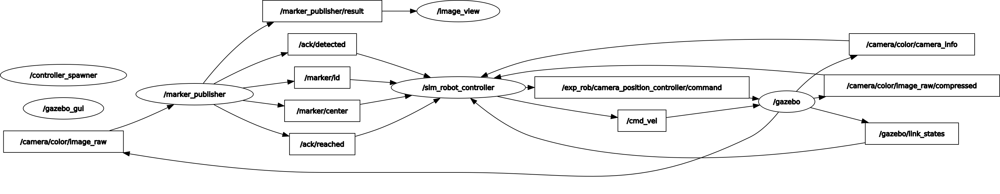
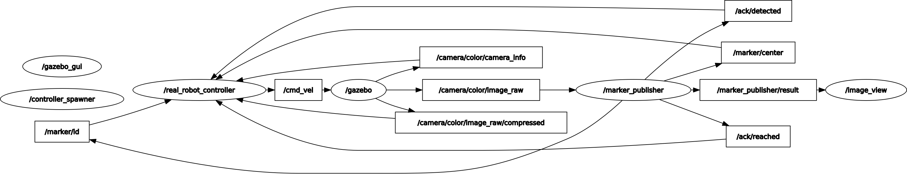

# Assignment 1

>Note: developed in ROS Noetic

## Group members

| Name Surname          | ID       |
| --------------------- | -------- |
| Gabriele Nicchiarelli | S4822677 |
| Ivan Terrile          | S4851947 |
| Miriam Anna Ruggero   | S4881702 |
| Davide Pisano         | S4363394 |

## Preliminary operations

Install dependencies:

```bash
cd ~/<your_workspace>
rosdep install --from-paths src --ignore-src -r -y
```

Build the workspace:

```bash
cd ~/<your_workspace>
catkin_make
```

## Run the Gazebo simulation

Run the simulation (with rotating camera):

```bash
roslaunch rosbot_gazebo assignment_gazebo.launch
```

Run the simulation (with fixed camera):

```bash
roslaunch rosbot_gazebo assignment_rosbot.launch
```

## Run on the Rosbot

#### Step 1: Connect to the local network

| Network name | Network password |
| ------------ | ---------------- |
| TP_LINK      | 03694008         |

#### Step 2: add the ROS master URI and user's IP address

Add the following lines at the bottom of the `~/.bashrc` file:

```bash
export ROS_MASTER_URI=https://192.168.1.10x:11311
export ROS_IP=<YOUR_IP_ADDRESS>
```

#### Step 3: Connect to the robot via SSH

```bash
ssh husarion@192.168.1.10x
# x is the identifier number of the robot (written on the bot)
```

**Password**: husarion

#### Step 4: Start the drivers

In the Rosbot terminal:

```bash
roslaunch tutorial_pkg all.launch
```

#### Step 5: Start the simulation

In the local terminal:

```bash
roslaunch rosbot_gazebo real_rosbot.launch
```

## Description of the packages

This project consists in making the Husarion Rosbot detect the ArUco markers in order.

The [marker publisher node](/src/aruco_ros/src/marker_publish.cpp) is responsible of detecting the markers and communicating the ID and center of the marker to the *controller node*. This node also communicates to the *controller node* when the desired marker has been reached.

The controller node is provided in two formats:
- The [real robot controller](/src/rosbot_navigation/scripts/real_robot_controller.py) which controls the real rosbot. In this case the camera is fixed and the whole robot has to rotate to detect the markers.
- The [sim robot controller](/src/rosbot_navigation/scripts/sim_robot_controller.py) which controls the robot in a simulated environment with Gazebo. In this simulation the camera can rotate to detect the markers.


Here is a description of the two nodes, with all the publishers and subscribers exposed.

For the [real robot controller](/src/rosbot_navigation/scripts/real_robot_controller.py) , there are the following publishers and subscribers:

- Publishers:
    - `self.image_pub = rospy.Publisher("/output/image_raw/compressed", CompressedImage, queue_size=1)`: to publish the compressed image from the camera
    - `self.vel_pub = rospy.Publisher("/cmd_vel", Twist, queue_size=1)`: to publish the velocity of the robot
- Subscribers:
    - `rospy.Subscriber("/camera/color/image_raw/compressed", CompressedImage, self.control_loop queue_size=1)`: to activate the following callback, called control_loop. This callback is called every time a new image is received from the camera and in summary, controls the movement of a robot based on markers detected in the compressed image. It adjusts the robot's velocity to move towards or rotate around to find the markers, depending on the conditions specified in the control logic.
        
        ```python
            def control_loop(self, msg : CompressedImage):
                # Proceed only if there are markers left
                if self.markers:
                    vel = Twist()

                    # If the marker is detected and it is the one we are looking for, else rotate
                    if self.detected_ack and self.marker_id == self.markers[0]:
                        if self.reached_ack:
                            self.reached_ack = False
                            self.markers.pop(0)

                            vel.linear.x = 0.0
                            vel.angular.z = 0.0

                            print("Reached: ", self.marker_id)
                        elif (self.camera_center.x < (self.marker_center.x + 10)) and (self.camera_center.x > (self.marker_center.x - 10)):
                            vel.linear.x = 0.4
                            vel.angular.z = 0.0
                            
                        else:
                            vel.linear.x = 0.05
                            if self.camera_center.x > self.marker_center.x:
                                vel.angular.z = 0.1
                            else:
                                vel.angular.z = -0.1
                    else:
                        vel.linear.x = 0.0
                        vel.angular.z = 0.35

                    self.vel_pub.publish(vel)
                else:
                    print("All markers reached!")
                    rospy.signal_shutdown("")
        ```
    - `rospy.Subscriber("/camera/color/camera_info", CameraInfo, self.camera_center_callback, queue_size=1`: to activate the following callback, called camera_center_callback. This callback is called every time a new camera info is received from the camera and it updates the center of the camera.
        ```python
            def camera_center_callback(self, msg : CameraInfo):
                self.camera_center.x = msg.width / 2
                self.camera_center.y = msg.height / 2
        ```
    - `rospy.Subscriber("/ack/detected", Bool, self.detected_callback, queue_size=1)`: to activate the following callback, called detected_callback. This callback is called every time a new ack is received from the marker publisher node and it updates the detected_ack variable. This variable is used in the control logic to understand if the marker is detected or not.
        ```python
            def detected_callback(self, msg : Bool):
                self.detected_ack = msg.data
        ```
    - `rospy.Subscriber("/ack/reached", Bool, self.reached_callback, queue_size=1)`: to activate the following callback, called reached_callback. This callback is called every time a new ack is received from the marker publisher node and it updates the reached_ack variable. This variable is used in the control logic to understand if the robot has reached the marker or not.
        ```python
            def reached_callback(self, msg : Bool):
                self.reached_ack = msg.data
        ```
    - `rospy.Subscriber('/marker/id', Int32, self.marker_id_callback, queue_size=1)`: to activate the following callback, called marker_id_callback. This callback is called every time a new marker id is received from the marker publisher node and it updates the marker_id variable. This variable is used in the control logic to understand which marker the robot is looking for.
        ```python
            def marker_id_callback(self, msg : Int32):
                self.marker_id = msg.data
        ```
    - `rospy.Subscriber('/marker/center', Point, self.marker_center_callback, queue_size=1)`: to activate the following callback, called marker_center_callback. This callback is called every time a new marker center is received from the marker publisher node and it updates the marker_center variable. This variable is used in the control logic to understand where the marker is located respect to the center of the camera.
        ```python
            def marker_center_callback(self, msg : Point):
                self.marker_center.x = msg.x
                self.marker_center.y = msg.y
        ```

For the [sim robot controller](/src/rosbot_navigation/scripts/sim_robot_controller.py), there are the same publishers and subscribers as the real robot controller, with the addition or modification of the following:

- Publishers:
    - `self.camera_pub = rospy.Publisher("/exp_rob/camera_position_controller/command",Float64, queue_size=1)`: to publish the position of the camera
- Subscribers:
    - `rospy.Subscriber("/camera/color/image_raw/compressed", CompressedImage, self.control_loop queue_size=1)`: In summary, this callback controls the movement of a robot based on markers detected by the camera. The robot remains stationary, and the camera rotates until it detects a marker. Once a marker is detected, the camera remains fixed on the marker, and the robot aligns itself with the camera by rotating around its z-axis. Once the camera and robot are aligned, the robot starts moving towards the marker. Meanwhile, the camera and robot are kept aligned through the controller until the robot reaches the marker. Upon reaching the marker, the callback restarts the process. The callback also checks if the marker is the one we are looking for, and if it is, it removes it from the list of markers to be reached. The callback also checks if all the markers have been reached, and if so, it shuts down the node.
    ```python
        def control_loop(self, msg : CompressedImage):
        # Proceed only if there are markers left
        if self.markers:
            vel_camera = Float64()
            vel_robot = Twist()

            # If the marker is detected and it is the one we are looking for, else rotate the camera
            if self.detected_ack and self.marker_id == self.markers[0]:
                vel_camera = 0.0

                if self.reached_ack and self.marker_id == self.markers[0]:
                    vel_robot.linear.x = 0.0
                    vel_robot.angular.z = 0.0
                    self.markers.pop(0) 
                    self.reached_ack = False 
                    print("Reached: ",self.marker_id)
                
                elif (self.camera_center.x < ((self.marker_center.x) + 12)) and (self.camera_center.x > (( self.marker_center.x) - 12) and math.fabs(self.err_yaw) <= math.pi / 90):
                    vel_robot.linear.x = 0.3
                    vel_robot.angular.z = self.err_yaw
                else:
                    if self.camera_center.x > self.marker_center.x:
                        vel_camera = 0.2
                    else:
                        vel_camera = -0.2
                    
                    if math.fabs(self.err_yaw) > math.pi/90:
                        vel_robot.angular.z = 3.0 * self.err_yaw
                        vel_camera = -3.0 * self.err_yaw
                        if vel_robot.angular.z > 0.6:
                            vel_robot.angular.z = 0.6
                            vel_camera = -0.6
                        elif vel_robot.angular.z < -0.5:
                            vel_robot.angular.z = -0.5
                            vel_camera = 0.5

                self.vel_pub.publish(vel_robot)
                self.camera_pub.publish(vel_camera)
            else:
               self.detected_ack = False
               vel_camera = 0.5 
               self.camera_pub.publish(vel_camera)
        else:
            print("All markers reached!")
            rospy.signal_shutdown("")
    ```
    - `rospy.Subscriber('/gazebo/link_states', LinkStates, self.joint_states_callback, queue_size=1)`: to activate the following callback, called joint_states_callback. This callback is called every time a new joint state is received from the gazebo and it updates the err_yaw variable. This variable is used in the control logic to understand the error between the yaw of the robot and the yaw of the camera.
        ```python
            def joint_states_callback(self, msg : LinkStates):
                quaternion_camera_link = (
                    msg.pose[10].orientation.x,
                    msg.pose[10].orientation.y,
                    msg.pose[10].orientation.z,
                    msg.pose[10].orientation.w
                )
                quaternion_base_link = (
                    msg.pose[9].orientation.x,
                    msg.pose[9].orientation.y,
                    msg.pose[9].orientation.z,
                    msg.pose[9].orientation.w
                )
                
                euler_cam = transformations.euler_from_quaternion(quaternion_camera_link)
                yaw_camera = euler_cam[2]
                euler_base = transformations.euler_from_quaternion(quaternion_base_link)
                yaw_base = euler_base[2]

                angle = yaw_camera - yaw_base
                if (math.fabs(angle) > math.pi):
                    angle = angle - (2 * math.pi * angle) / (math.fabs(angle))

                self.err_yaw = angle
        ```

In any case, the functioning of the controllers is described in the [flowcharts below](#flowcharts) below.

To control the camera a *joint state controller* has been added in the rosbot_description package.

### Pub/sub architecture

#### Gazebo rqt graph



#### Rosbot rqt graph



Note: in the real Rosbot the topic `/camera/color/` is substituted by `/camera/rgb`.

### Flowcharts


### Video demo

[](./media/video_demo.mp4)

## References

- [Husarion ROSbot](https://husarion.com/manuals/rosbot/)

- [ROSbot GitHub repository](https://github.com/husarion/rosbot_ros/tree/noetic)

- [Aruco ROS](https://github.com/CarmineD8/aruco_ros)

## Troubleshoot

Here goes the description of the problems encountered and how they were solved.